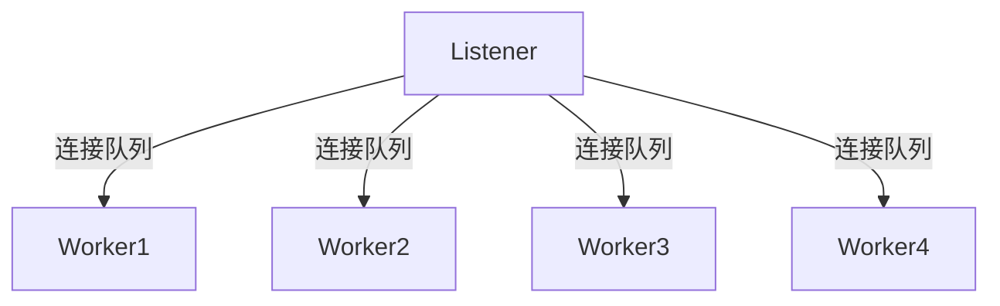

在多线程访问同一块数据时，往往需要加锁来保证数据一致性，但在特殊场景下，队列可以lock-free地实现线程安全。这里是真正的线程安全，不需要依靠CAS操作、内存屏障这些操作系统提供的设施来实现。
<!--more-->

## 场景
所谓的特殊场景，就是只有**单个生产者，单个消费者**。这里介绍一下我在工作中遇到的一种场景，一个高并发的TCP长连接服务中，Listener线程监听某一端口上的新连接，建立好连接后，根据某种负载均衡策略选择Worker来为新连上来的客户端提供服务。

这里每个Worker具备一个队列，是一个典型的单生产者单消费者场景。

其实在这个场景下，无锁并不会带来太大的性能收益。锁的开销主要来源于几个方面：
1. 系统调用本身的开销
2. 多线程竞争同一把锁，产生了阻塞现象.
{:.info}

## 分析
为什么需要实现无锁？
