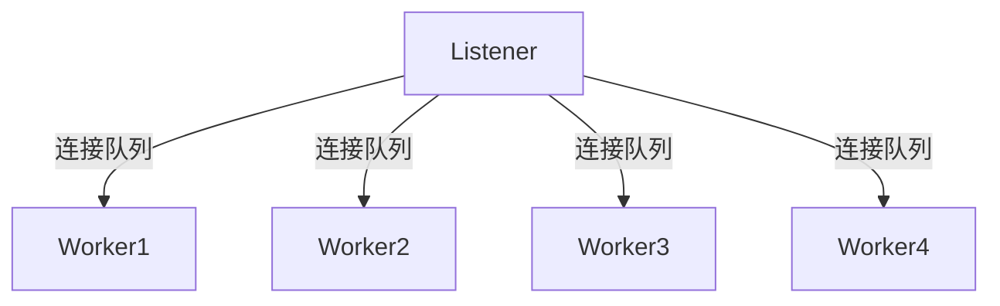

在多线程访问同一块数据时，往往需要加锁来保证数据一致性，但在特殊场景下，队列可以lock-free地实现线程安全。这里是真正的线程安全，不需要依靠CAS操作、内存屏障这些操作系统提供的设施来实现。
<!--more-->

## 场景
所谓的特殊场景，就是只有**单个生产者，单个消费者**。这里介绍一下我在工作中遇到的一种场景，一个高并发的TCP长连接服务中：
1. Listener线程监听某一端口上的新连接，并建立好连接。
2. 根据某种负载均衡策略选择Worker来为新连上来的客户端提供服务。
3. 将新连接加入到对应Worker的队列中，并告知它，队列中有新连接了，赶快来处理。

这里每个Worker具备一个队列，是一个典型的单生产者单消费者场景, 这样的队列是可以完全无锁实现的，无锁的好处，提升性能，不会死锁等等。

在这个场景下，无锁并不会带来太大的性能收益。尽管如此，迈出这一步对自己总有好处.
{:.warning}

## 无锁的原理
``` 
              -----+---------+---------+---------+---------+----------+---------+-----
    Worker <--     |  conn1  |  conn2  |  conn3  |  conn4  |  conn5   |  conn6  |         <--- Listener
              -----+---------+---------+---------+---------+----------+---------+-----
                      out                                                           in 
             
```
在上图中，
1. Listener从in指针处往后写数据，修改in指针。
2. Worker从out处取数据，修改out指针。
3. 有效数据位于[out, in)这个左闭右开区间内。

Listener每次往队列中插入一条数据后，通知Worker有新数据。Worker被唤醒后，需要知道队列中具体有多少条数据以尽量一次性取完，这时候它就可以正确地取出数据。

**1. Worker读取in指针，直接计算队列的size.**

这种方式若不加以控制，也是会出问题的。首先来看一下Listener往队列中添加数据的代码片段：

//Listener code
buffer[in] = new_connection;
in = in + 1;

尽管我们先添加数据，后修改in指针，但现代编译器的优化，和多核CPU的交互都有可能造成指令乱序执行，导致in指针修改比buffer的写入先完成，这时候Worker读到的in指针将是无效的。解决这个问题需要使用内存屏障，具体可以参考linux中kfifo的实现，在代码中嵌入内联汇编即可。

**2. 使用eventfd，由内核来维护计数器，同时也可以实现通知的功能。**

eventfd是一种线程间通信方式，它的计数器由内核维持，在这里它的工作方式如下：

（1）Worker创建一个eventfd，用于接受新连接的通知，并将其挂在epoll上监听其可读事件（初始化计数器为0）。

（2）Listener往队列中添加新数据后，调用write往eventfd上写入新添加数据个数(内核会将数值累加到计数器上)。

（3）Worker监听到eventfd可读事件后，调用read从eventfd上读出队列中总数据个数（内核会返回计数器值，并将计数器清零）。

这样，既可以实现唤醒Worker，又可以让Worker知道队列中一共有多少数据。使用eventfd还有另一个好处，它可以与timerfd，socket一样被epoll监听，这样整个系统可以更加统一。
